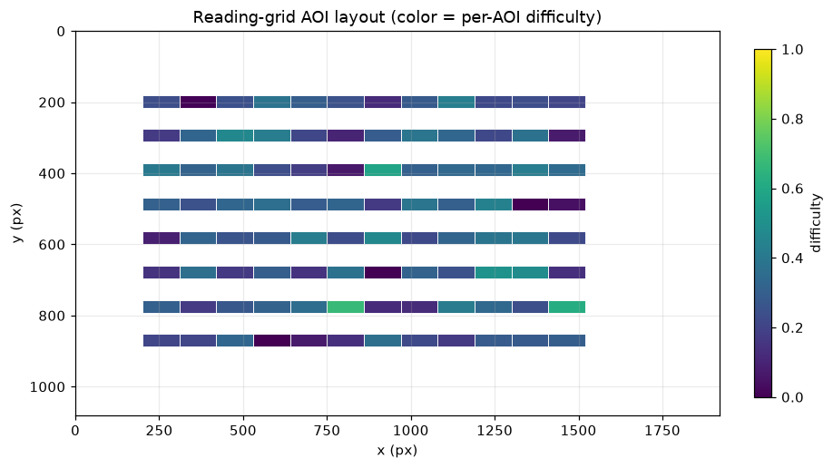
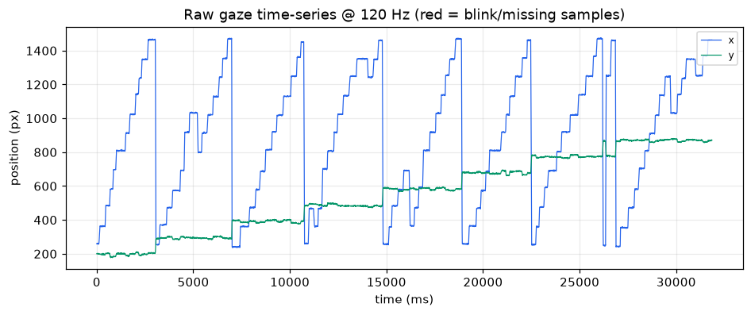
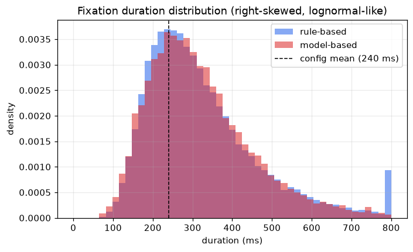
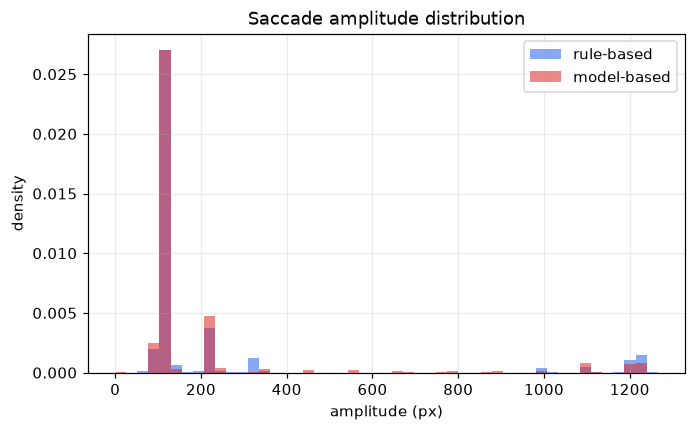
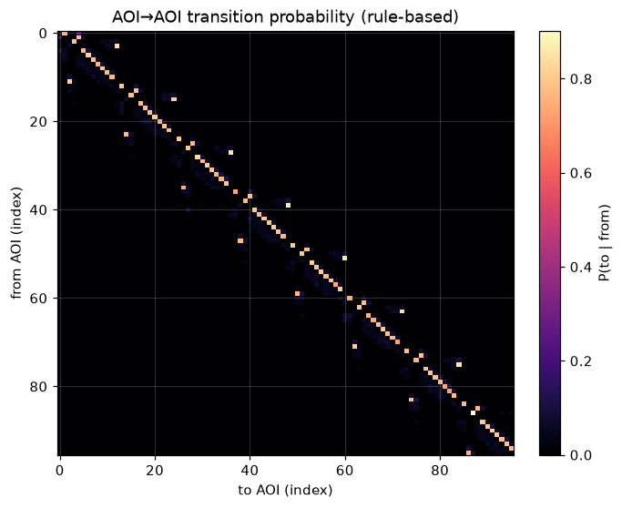
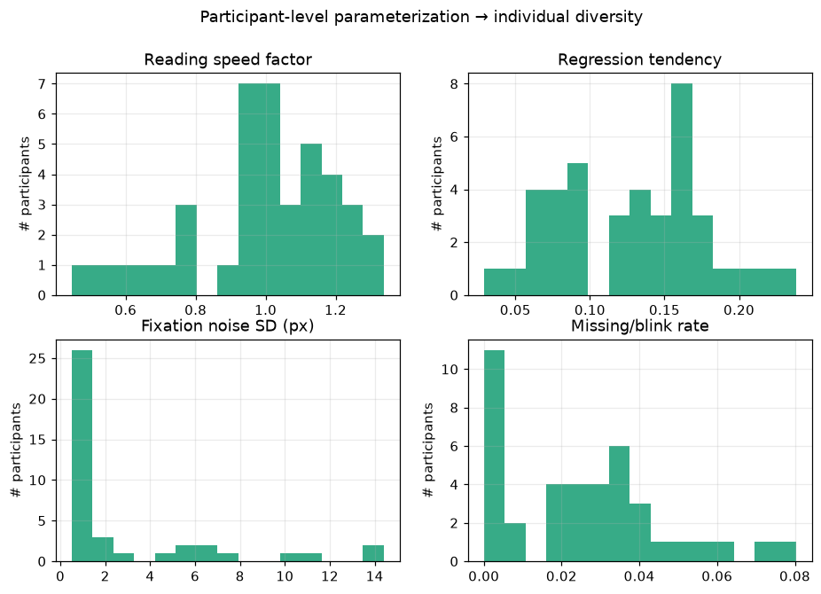
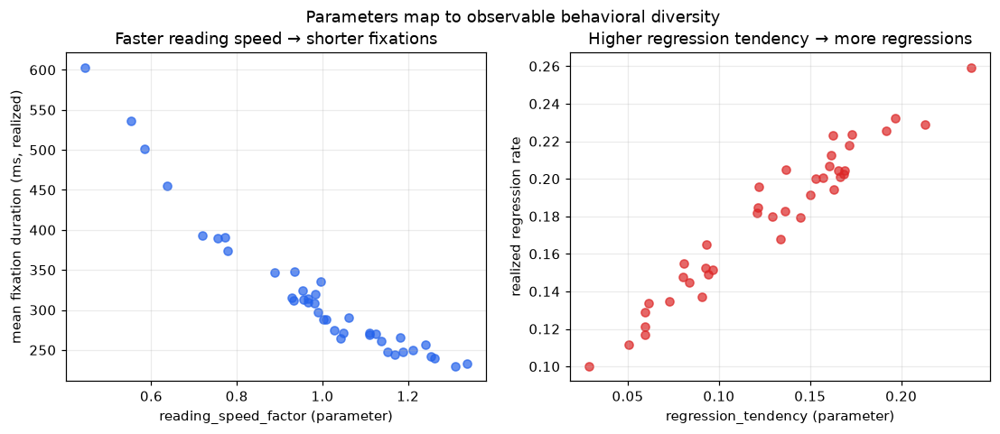
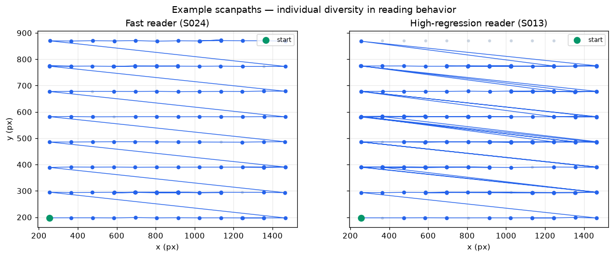

# Synthetic Eye-Tracking Data — What We Generate, Why, and How

[TOC]

This report explains the **synthetic eye-tracking data** produced by this project: what the
data looks like (with visualizations), the **empirical/literature grounding** behind the
parameters, the **two generative models** (rule-based and model-based), and how the generators
are **parameterized to produce individual (participant-level) diversity**.

All figures below were produced by `scripts/make_report_figures.py` from a reproducible run
(`seed = 42`).

> **Run summary.** 40 simulated participants × 5 stimuli × 6 trials/participant.
> Reading-grid stimuli with **96 AOIs** each (8 lines × 12 words).
> Output: **67,279** rule-based events and **1,451,051** raw-gaze samples at **120 Hz**.

---

## 1. What kind of data is generated?

The generators emit three views of the *same* underlying behavior, all sharing one schema so
rule-based and model-based output are directly comparable:

| Data view | Granularity | Key columns | Use |
|-----------|-------------|-------------|-----|
| **Event-level** | one row per fixation / saccade / blink | `event_type`, `start/end/duration_ms`, `x_px`, `y_px`, `aoi_id`, `saccade_amp_px`, `saccade_angle_deg`, `validity` | the primary, interpretable representation |
| **Raw gaze time-series** | one row per sample (120 Hz) | `timestamp_ms`, `x_px`, `y_px`, `pupil_size`, `validity`, `event_index` | mimics what a real tracker streams |
| **AOI summary** | one row per (participant × trial × AOI) | `first_fixation_duration_ms`, `total_fixation_duration_ms`, `fixation_count`, `visit_count`, `time_to_first_fixation_ms`, `regression_count` | the reading-research feature set |

A core design principle is **event-first generation**: we build interpretable fixation/saccade
events, then *expand* them into a raw 120 Hz signal — rather than synthesizing raw gaze directly.

### 1.1 Stimulus: the reading-grid AOI layout

Stimuli model a page of text as a grid of word-level Areas of Interest (AOIs), laid out
left→right, top→bottom. Each AOI carries a **difficulty** value that modulates fixation behavior.



### 1.2 Raw gaze time-series (120 Hz)

Events are expanded to a continuous signal: fixation samples sit near the AOI center (+noise),
saccade samples interpolate between fixations, and **blink/missing** samples are set to `NaN`
with `validity = 0` (red lines below).



---

## 2. Visualizing the behavior

### 2.1 Fixation duration distribution

Fixation durations are **right-skewed** (lognormal-like): a dense mode around the typical
reading fixation with a long tail of longer fixations on difficult words. The realized mean
(~323 ms) sits above the base config mean (240 ms) because durations are **scaled up by AOI
difficulty and inverse reading speed** — exactly the mechanism that creates difficulty and
individual effects (Sections 3–4).



### 2.2 Saccade amplitude distribution

Saccade amplitudes follow inter-AOI geometry: most are short forward steps to the next word,
with a tail of long return-sweep and regression saccades.



### 2.3 AOI transition structure

The transition matrix shows the reading "ribbon": strong probability mass just off the diagonal
(forward word-by-word movement), plus return-sweep and regression structure.



---

## 3. The two generators

Both generators implement the same interface and emit the same schema (`generate_events` →
`generate_raw_gaze` → `generate_aoi_summary`). The guiding philosophy is **explainable-first**.

### 3.1 Rule-based generator

Synthesizes behavior from explicit assumptions and distributions (no training data required):

1. **Participants** — each gets a trait vector (Section 4) sampled from configured distributions.
2. **Stimuli & AOIs** — reading-grid layout with per-AOI difficulty.
3. **Scanpath** — an AOI-to-AOI walk that is *forward-dominant* but probabilistically **skips**
   ahead, **regresses** to earlier words, and performs **line breaks** (return sweeps). The
   probabilities are modulated by the participant's `regression_tendency` / `skip_tendency`.
4. **Fixations** — placed at AOI center + Gaussian noise; duration drawn from a (truncated)
   lognormal, **scaled by AOI difficulty and the participant's reading speed**.
5. **Saccades** — inserted between fixations; amplitude = inter-fixation distance, duration from a
   truncated normal, velocity = amplitude/duration, angle = `atan2(dy, dx)`.
6. **Blinks / missing** — inserted per the blink rate; corresponding raw samples are nulled.

### 3.2 Model-based generator

Learns from (pseudo-)reference data and samples — initially with **explainable statistical
models**, no deep learning:

- **Parametric model** — fits the marginal distributions (fixation duration: lognormal *vs*
  gamma chosen by **AIC**; saccade duration: normal *vs* lognormal; saccade amplitude: empirical
  quantiles; missing rate: beta), with method-of-moments / empirical fallbacks for small samples.
- **Markov transition model** — a first-order chain over a **relative-move state space**
  (`next`, `skip`, `regression_1`, `regression_2plus`, `line_break`, `end`), estimated from the
  reference and sampled at generation time (Laplace-smoothed, forward-reading prior).
- **HMM (optional)** — a Gaussian HMM over `[fixation_duration, saccade_amplitude]` with hidden
  reading "modes" (e.g. *normal / careful / skimming / rereading*). It is opt-in and degrades
  gracefully when `hmmlearn` is not installed (no hard dependency).

### 3.3 How well does the model reproduce the reference?

Fitting the model-based generator on the rule-based output and comparing distributions:

| Quantity | KS statistic | Notes |
|----------|--------------|-------|
| Fixation duration | **0.018** | near-identical marginal (Wasserstein ≈ 5.1 ms) |
| Saccade amplitude | **0.159** | close; small shape differences |
| AOI transition matrix | distance ≈ **1.51** (Frobenius) | structure preserved; scanpaths terminate earlier under the learned Markov model |

The marginal distributions match very closely; the main divergence is **scanpath length**, an
*expected* consequence of the learned termination behavior rather than a correctness issue.

---

## 4. Parameterizing individual diversity

A central goal is that synthetic *participants differ from one another* in psychologically
meaningful ways. Each participant is assigned a **trait vector**, sampled from configurable
population distributions:

| Trait | Meaning | Sampled range (this run) |
|-------|---------|--------------------------|
| `reading_speed_factor` | overall speed; scales fixation durations | 0.45 – 1.34 |
| `regression_tendency` | propensity to re-read earlier words | 0.03 – 0.24 |
| `fixation_noise_sd` | spatial imprecision of fixations (px) | 0.5 – 14.4 |
| `missing_rate` | blink / data-loss rate | 0.00 – 0.08 |
| `skip_tendency` | propensity to skip words | configurable |
| `pupil_baseline` | baseline pupil size | configurable |



Crucially, these parameters are **not cosmetic** — they translate into observable behavioral
differences. Faster readers produce shorter fixations; higher regression tendency produces more
regressive saccades:



This is also visible qualitatively in individual scanpaths — a fast, low-regression reader sweeps
cleanly left-to-right, while a high-regression reader's path is full of backward jumps:



Beyond participant-level variability, **stimulus-level difficulty** (per-AOI `difficulty`)
lengthens fixations and increases regressions on hard words, so the same participant behaves
differently across easy vs hard text.

---

## 5. Literature grounding

The parameter defaults are grounded in the classic reading eye-movement literature. The four
canonical anchors (Rayner 1998/2009; E-Z Reader, Reichle et al. 1998; SWIFT, Engbert et al. 2005)
were citation-verified for venue/year. Where a default is a defensible *modeling convention*
rather than a single sourced number, this is stated explicitly.

### Empirical parameter grounding

| Generator parameter (default) | Literature value / finding | Source | Note |
|---|---|---|---|
| Fixation duration ~240 ms mean, right-skewed, ~80–800 ms | Mean fixation in silent reading ≈ 200–250 ms; positively-skewed; long tail | Rayner (1998); Rayner (2009) | 240 ms is within the cited mean range. Lognormal/gamma captures the right skew (Holmqvist et al., 2011). The 80–800 ms clipping is a generous range, not a single sourced number. |
| Saccade duration ~35 ms | Duration scales with amplitude; reading saccades ~20–40 ms (~30 ms typical) | Rayner (1998); Holmqvist et al. (2011) | 35 ms is a reasonable fixed proxy for an amplitude-dependent (main-sequence) duration. Modeling choice. |
| Saccade amplitude ~7–9 char spaces (~2°) | Mean forward saccade ≈ 7–9 letter spaces in alphabetic reading | Rayner (1998); Rayner (2009) | Directly sourced. Char-space ↔ degrees depends on font size / viewing distance, so ~2° is approximate. |
| Amplitude tied to inter-word distance | Landing near word center (preferred viewing location); length governed by word boundaries | Rayner (1998); Reichle et al. (1998); Engbert et al. (2005) | Mechanistically motivated by E-Z Reader and SWIFT. |
| Regression rate ~10–15% of saccades | ~10–15% of saccades in skilled reading; rises with difficulty | Rayner (1998); Rayner (2009) | Directly within the cited range. |
| Word skipping ~8% | Strongly a function of word length/predictability: short words skipped ~60–70%, long ~20% | Rayner & McConkie (1976); Rayner et al. (2011) | A single 8% scalar is a simplification; literature favors length/frequency-conditioned skipping. Flagged as a baseline. |
| Forward dominance ~78% of transitions | Reading is predominantly forward; with ~10–15% regressions + re-fixations, forward transitions dominate | Rayner (1998); Rayner (2009) | 78% is a derived value consistent with reported regression rates, not a directly quoted figure. |
| Blink / missing data | Blinks and tracker loss are standard sources of missing samples | Holmqvist et al. (2011) | No canonical "reading blink rate"; treated as a realism feature, not a sourced constant. |
| Pupil baseline & variability | Pupil diameter is task-/luminance-dependent; an index of cognitive load | Holmqvist et al. (2011) | No universal baseline; justified as a configurable, individually-varying parameter. |
| Individual differences in reading speed | Large, documented variation in reading rate; models fit per-reader parameters | Rayner (1998, 2009); Engbert et al. (2005) | Supports per-individual parameterization (reader-level random effects). |
| Text-difficulty effects on fixations | Fixations lengthen, regressions increase with lexical/syntactic/conceptual difficulty | Rayner (1998); Rayner (2009) | Supports conditioning fixation durations on difficulty. |
| AOI / interest-area methodology | Word/region interest areas are the standard unit (first-fixation, gaze duration, total time, regressions) | Holmqvist et al. (2011); Rayner (1998) | Methodologically grounded. |
| Fixation/saccade segmentation | Velocity-threshold (I-VT) and dispersion-threshold (I-DT) are the standard taxonomy | Salvucci & Goldberg (2000) | Standard methods for deriving events from samples. |

### Computational models of reading eye movements

**E-Z Reader** (Reichle, Pollatsek, Fisher & Rayner, 1998) is a serial-attention model in which
lexical processing drives the eyes: a "familiarity check" triggers saccade programming, while full
lexical access shifts attention to the next word. It reproduces frequency/predictability effects on
fixation durations, skipping, and re-fixations with a small set of interpretable parameters.
**SWIFT** (Engbert, Nuthmann, Richter & Kliegl, 2005) is a competing *dynamical* model assuming
spatially distributed (parallel) lexical processing across the perceptual span, with autonomous,
stochastically-timed saccade generation. Both are mechanistic process models validated against
corpus distributions — the gold standard for explaining *why* reading eye movements have the
statistics they do.

Simpler **Markov / HMM scanpath models** sit at a different abstraction level: rather than
simulating cognition, they model the *sequence* of states (forward step, skip, re-fixation,
regression) as transition probabilities, optionally with hidden reading-mode states. They are
descriptive and data-light but transparent, fast to fit, and easy to validate against transition
rates. This motivates our **M2 design — parametric + Markov ("explainable-first")**: parametric
distributions reproduce the marginals grounded in Rayner (1998/2009), while the Markov layer
reproduces sequential structure (forward dominance, regression/skip rates). Every knob maps to a
reported empirical quantity — a deliberate trade of E-Z Reader/SWIFT's deeper cognitive fidelity
for interpretability and controllability appropriate to a synthetic-data generator.

### Synthetic data & privacy

Eye-movement recordings are increasingly understood to be **biometric**: reading scanpaths and
oculomotor dynamics can re-identify individuals at high accuracy (Holland & Komogortsev, 2011;
Jäger et al., 2020). Raw or lightly de-identified gaze data therefore carries genuine
re-identification risk, and aggregation (e.g. heatmaps) does not by itself guarantee anonymity.
Two responses are relevant. First, **formal privacy mechanisms**: Steil et al. (2019) applied
differential privacy to aggregated eye-movement features; Bozkir et al. (2021) addressed temporal
correlations that weaken naive DP; and DP *synthesis* approaches generate gaze under DP guarantees.
Second, **synthetic data as a privacy tool**: David-John et al. (2022, "For Your Eyes Only") study
privacy/utility trade-offs in eye-tracking datasets. The implication for this project: a generator
should be evaluated not only on statistical fidelity but with a **privacy-proxy evaluation** —
confirming synthetic samples do not enable re-identification back to any source individual — because
plausible-looking gaze can still leak identity if it preserves person-specific signatures. This is
exactly why the evaluation framework includes nearest-neighbor distance, a re-identification proxy,
and a membership-inference proxy.

### References

> Verified by search for author/title/venue/year. DOIs/URLs are included only where confirmed;
> fields that could not be fully verified are marked *(unverified)*.

- Reichle, E. D., Pollatsek, A., Fisher, D. L., & Rayner, K. (1998). Toward a model of eye movement control in reading. *Psychological Review*, 105(1), 125–157. https://doi.org/10.1037/0033-295X.105.1.125
- Rayner, K. (1998). Eye movements in reading and information processing: 20 years of research. *Psychological Bulletin*, 124(3), 372–422. https://doi.org/10.1037/0033-2909.124.3.372
- Rayner, K. (2009). Eye movements and attention in reading, scene perception, and visual search. *Quarterly Journal of Experimental Psychology*, 62(8), 1457–1506. https://doi.org/10.1080/17470210902816461
- Rayner, K., & McConkie, G. W. (1976). What guides a reader's eye movements? *Vision Research*, 16(8), 829–837. https://doi.org/10.1016/0042-6989(76)90143-7
- Rayner, K., Slattery, T. J., Drieghe, D., & Liversedge, S. P. (2011). Eye movements and word skipping during reading: Effects of word length and predictability. *Journal of Experimental Psychology: Human Perception and Performance*, 37(2), 514–528 *(unverified)*. https://doi.org/10.1037/a0020990
- Engbert, R., Nuthmann, A., Richter, E. M., & Kliegl, R. (2005). SWIFT: A dynamical model of saccade generation during reading. *Psychological Review*, 112(4), 777–813. https://doi.org/10.1037/0033-295X.112.4.777
- Salvucci, D. D., & Goldberg, J. H. (2000). Identifying fixations and saccades in eye-tracking protocols. In *ETRA '00* (pp. 71–78). ACM. https://doi.org/10.1145/355017.355028
- Holmqvist, K., Nyström, M., Andersson, R., Dewhurst, R., Jarodzka, H., & Van de Weijer, J. (2011). *Eye Tracking: A Comprehensive Guide to Methods and Measures*. Oxford University Press. ISBN 978-0199697083.
- Holland, C., & Komogortsev, O. V. (2011). Biometric identification via eye movement scanpaths in reading. In *IJCB 2011* (pp. 1–8). IEEE *(DOI unverified)*.
- Steil, J., Hagestedt, I., Huang, M. X., & Bulling, A. (2019). Privacy-aware eye tracking using differential privacy. In *ETRA '19*. ACM *(pages unverified)*. https://doi.org/10.1145/3314111.3319915
- Bozkir, E., Ünal, A. B., Akgün, M., Kasneci, E., & Pfeifer, N. (2021). Differential privacy for eye tracking with temporal correlations. *PLOS ONE*, 16(8), e0255979 *(article-id unverified)*.
- David-John, B., Hosfelt, D., Butler, K., & Jain, E. (2022). For your eyes only: Privacy-preserving eye-tracking datasets. In *ETRA '22*. ACM *(pages unverified)*. https://doi.org/10.1145/3517031.3529618
- Jäger, L. A., Makowski, S., Prasse, P., Liehr, S., Seidler, M., & Scheffer, T. (2020). Deep Eyedentification: Biometric identification using micro-movements of the eye. In *ECML PKDD 2019*, LNCS 11907 (pp. 299–314). Springer *(pages unverified)*.

---

## 6. Reproducibility

```bash
uv sync
uv run pytest                     # 55 passed, 1 skipped

# regenerate every figure + stats in this report
uv run python scripts/make_report_figures.py
uv run --with markdown python scripts/build_html.py   # -> docs/index.html
```

Everything is seeded (`seed = 42`), so figures and statistics regenerate identically.

<p class="muted">Generated for the <code>synthetic-eye-tracking</code> project.</p>
