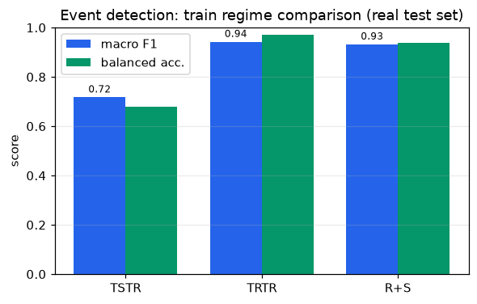
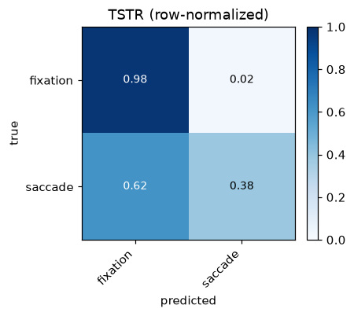
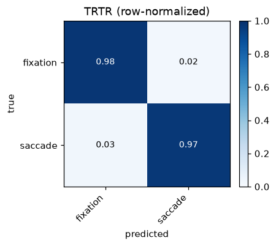

# Synthetic Eye-Tracking Data for Reading: Generation, Parameterization, and Grounding

[TOC]

This report describes the synthetic eye-tracking data produced by this project. It covers what
the data contains, how the two generators work, how participant-level variability is
parameterized, what empirical literature the parameter choices draw on, where the current
implementation falls short, and a first sim-to-real experiment testing whether synthetic data can
train an event detector that transfers to real recordings. Figures and statistics come from a
single seeded run of
`scripts/make_report_figures.py` (`seed = 42`); rerunning reproduces them exactly.

> Run summary: 40 simulated participants, 5 stimuli, 6 trials per participant. Each stimulus is a
> reading grid of 96 AOIs (8 lines × 12 words). The run produced 67,279 rule-based events and
> 1,451,051 raw-gaze samples at 120 Hz.

---

## 1. What the data contains

Each generator emits three views of the same simulated behavior, sharing one schema so that
rule-based and model-based output can be compared directly.

| View | Granularity | Key columns | Role |
|------|-------------|-------------|------|
| Event-level | one row per fixation / saccade / blink | `event_type`, `start/end/duration_ms`, `x_px`, `y_px`, `aoi_id`, `saccade_amp_px`, `saccade_angle_deg`, `validity` | the interpretable primary representation |
| Raw gaze | one row per sample (120 Hz) | `timestamp_ms`, `x_px`, `y_px`, `pupil_size`, `validity`, `event_index` | approximates a tracker's sample stream |
| AOI summary | one row per (participant × trial × AOI) | `first_fixation_duration_ms`, `total_fixation_duration_ms`, `fixation_count`, `visit_count`, `time_to_first_fixation_ms`, `regression_count` | the reading-research feature set |

The generators build event-level data first and then expand it into a raw 120 Hz signal, rather
than synthesizing the raw signal directly. Working at the event level keeps the generative
assumptions explicit and lets the same events drive both the raw stream and the AOI summaries.

### 1.1 Stimulus: the reading-grid AOI layout

A stimulus represents a page of text as a grid of word-level Areas of Interest (AOIs), arranged
left to right and top to bottom. Each AOI is assigned a difficulty value that scales fixation
behavior on that word. Note that these AOIs are abstract cells, not real words; difficulty is
drawn at random rather than derived from word length or frequency (see Section 6).


### 1.2 Raw gaze time-series (120 Hz)

The expansion places fixation samples near the AOI centre with added noise, interpolates saccade
samples linearly between successive fixations, and marks blink and missing samples as `NaN` with
`validity = 0` (red lines below).


---

## 2. The simulated behavior

### 2.1 Fixation durations

Fixation durations are right-skewed, with a mode near the typical reading fixation and a tail of
longer fixations on harder words, which is the shape commonly modelled as lognormal or gamma. In
this run the realized mean is about 323 ms (median 292 ms). That is higher than the 200–250 ms
usually reported for skilled silent reading. The gap is a direct consequence of how durations are
built: the configured 240 ms is the mean of the unscaled draw, which is then multiplied by a
difficulty-dependent factor `(1 + 0.6·difficulty)` and divided by the participant's reading-speed
factor. Both terms push the realized mean above the base. Recentring them would bring the mean into the empirical range; the
current values are kept because they make the difficulty and individual effects easy to see in
this demonstration. This is a calibration choice rather than a fit to human data (Section 6).


### 2.2 Saccade amplitudes

Saccade amplitude follows the geometry of the AOI grid. Most saccades are short forward steps to a
nearby word; a tail of longer saccades comes from line-final return sweeps and regressions. The
mean amplitude here is about 227 px. With roughly 110 px-wide word AOIs that is close to two
word-widths, larger than a single forward step because the mean pools long return sweeps and
regressions with the short forward saccades.


### 2.3 AOI transition structure

The AOI-to-AOI transition matrix concentrates probability just off the diagonal, reflecting
word-by-word forward movement, with additional mass for return sweeps and regressions.


---

## 3. The two generators

Both generators share an interface (`generate_events` → `generate_raw_gaze` →
`generate_aoi_summary`) and emit the same schema. Each step is a named, inspectable operation,
which keeps the generative assumptions easy to audit.

### 3.1 Rule-based generator

The rule-based generator synthesizes behavior from explicit assumptions and distributions and
needs no training data.

1. Participants. Each participant receives a trait vector (Section 4) sampled from the configured
   population distributions.
2. Stimuli and AOIs. A reading-grid layout is built, with a difficulty value per AOI.
3. Scanpath. An AOI-to-AOI walk is generated. It is forward-dominant but moves to a skipped word,
   regresses to an earlier word, or breaks to the next line with configurable probabilities, which
   are adjusted by the participant's `regression_tendency` and `skip_tendency`.
4. Fixations. A fixation is placed at the AOI centre plus Gaussian noise, whose spread also grows
   with AOI difficulty. The duration is drawn from a truncated lognormal and then multiplied by
   `(1 + 0.6·difficulty)` and divided by the reading-speed factor.
5. Saccades. Between consecutive fixations a saccade is inserted, with amplitude equal to the
   inter-fixation distance, duration from a truncated normal, velocity equal to amplitude over
   duration, and angle from `atan2(dy, dx)`.
6. Blinks and missing data. Blinks are inserted at the configured rate, and the corresponding raw
   samples are set to missing.

### 3.2 Model-based generator

The model-based generator learns from reference data and then samples. The initial version uses
interpretable statistical models and no deep learning.

- Parametric model. Fits the marginal distributions: fixation duration (lognormal or gamma,
  selected by AIC), saccade duration (normal or lognormal), saccade amplitude (empirical
  quantiles), and missing rate (beta), with method-of-moments or empirical fallbacks when a sample
  is small.
- Markov transition model. A first-order chain over a relative-move state space (`next`, `skip`,
  `regression_1`, `regression_2plus`, `line_break`, `end`), estimated from the reference with
  Laplace smoothing and a forward-reading prior, then sampled at generation time.
- HMM (optional). A Gaussian HMM over `[fixation_duration, saccade_amplitude]` with a few hidden
  reading modes (for example normal, careful, skimming, rereading). It is opt-in and skipped when
  `hmmlearn` is absent, so it is not a hard dependency.

### 3.3 Recovering a known generating process

The table below fits the model-based generator on the rule-based output and compares the two.

| Quantity | KS statistic | Note |
|----------|--------------|------|
| Fixation duration | 0.018 | very close marginal (Wasserstein ≈ 5.1 ms) |
| Saccade amplitude | 0.159 | close, with minor shape differences |
| AOI transition matrix | Frobenius distance ≈ 1.51 | qualitatively similar; see caveat below |

These numbers should be read with care. The reference here is the rule-based generator's own
output, so the comparison measures how faithfully the parametric and Markov models recover a
*known* generating process, not how well either matches human reading. Close agreement on the
marginals is partly expected for that reason, and we report it only as a sanity check on the
fitting pipeline. External validation against a public human dataset is part of M3 and has not
been done yet.

Two differences remain even in this internal comparison. The model produced 25,310
events against the rule-based 67,279, and scanpaths under the learned Markov chain terminate
earlier than the near-complete grid sweeps of the rule-based source. The transition-matrix
distance is a single aggregate that also depends on how the two AOI sets are aligned, so it is
indicative rather than precise.

---

## 4. Parameterizing individual variability

A goal of the generator is that simulated participants differ from one another in behaviorally
distinct ways. Each participant is given a trait vector sampled from configurable population
distributions.

| Trait | Meaning | Sampled range (this run) |
|-------|---------|--------------------------|
| `reading_speed_factor` | overall speed; scales fixation durations | 0.45 – 1.34 |
| `regression_tendency` | propensity to re-read earlier words | 0.03 – 0.24 |
| `fixation_noise_sd` | spatial imprecision of fixations (px) | 0.5 – 14.4 |
| `missing_rate` | blink / data-loss rate | 0.00 – 0.08 |
| `skip_tendency` | propensity to skip words | derived from `skip_prob` + noise |
| `pupil_baseline` | baseline pupil size | configurable |


These parameters are not cosmetic: they map onto measurable differences in the output. Faster
readers produce shorter fixations, and participants with a higher regression tendency produce more
regressive saccades.


The realized regression rate in the right-hand panel is an angle-based proxy (the fraction of
saccades pointing leftward or upward, here taken as `|angle| > 120°`). It is a rough operational
measure rather than the linguistically defined regression rate, and the high-regression simulated
readers deliberately exceed the 10–15% typical of skilled reading to make the effect visible.

The same contrast appears in individual scanpaths. A fast, low-regression reader sweeps fairly
cleanly from left to right, while a high-regression reader's path contains many backward jumps.


Variability also comes from the stimulus side: per-AOI difficulty lengthens fixations and raises
regressions on harder words, so a given participant behaves differently across easier and harder
text.

---

## 5. Grounding in the reading literature

The parameter defaults draw on the classic reading eye-movement literature. The four main anchors
(Rayner 1998 and 2009; the E-Z Reader model, Reichle et al. 1998; the SWIFT model, Engbert et al.
2005) were checked for venue and year. Where a default is a modelling convention rather than a
single sourced number, the table says so.

### 5.1 Empirical parameter grounding

| Generator parameter (default) | Literature value / finding | Source | Note |
|---|---|---|---|
| Fixation duration ~240 ms mean, right-skewed, ~80–800 ms | Mean fixation in silent reading ≈ 200–250 ms; positively skewed; long tail | Rayner (1998); Rayner (2009) | 240 ms is within the cited mean range. Lognormal/gamma captures the right skew (Holmqvist et al., 2011). The 80–800 ms clipping is a generous range, not a sourced number. |
| Saccade duration ~35 ms | Duration scales with amplitude; reading saccades ~20–40 ms (~30 ms typical) | Rayner (1998); Holmqvist et al. (2011) | 35 ms is a fixed proxy for an amplitude-dependent duration; a modelling choice (see Section 6). |
| Saccade amplitude ~7–9 char spaces (~2°) | Mean forward saccade ≈ 7–9 letter spaces in alphabetic reading | Rayner (1998); Rayner (2009) | Directly sourced. The char-space to degree conversion depends on font size and viewing distance, so ~2° is approximate. |
| Amplitude tied to inter-word distance | Landing near word centre (preferred viewing location); length governed by word boundaries | Rayner (1998); Reichle et al. (1998); Engbert et al. (2005) | Motivated by E-Z Reader and SWIFT. |
| Regression rate ~10–15% of saccades | ~10–15% of saccades in skilled reading; rises with difficulty | Rayner (1998); Rayner (2009) | Within the cited range. |
| Word skipping ~8% | Strongly a function of word length and predictability: short words skipped ~60–70%, long ~20% | Rayner & McConkie (1976); Rayner et al. (2011) | A single 8% rate is a simplification; the literature favours length- and frequency-conditioned skipping. Flagged as a baseline. |
| Forward dominance ~78% of transitions | Reading is predominantly forward; with ~10–15% regressions and some re-fixations, forward transitions dominate | Rayner (1998); Rayner (2009) | 78% is a derived value consistent with reported regression rates, not a quoted figure. |
| Blink / missing data | Blinks and tracker loss are standard sources of missing samples | Holmqvist et al. (2011) | No canonical reading blink rate; treated as a realism feature. |
| Pupil baseline & variability | Pupil diameter is task- and luminance-dependent; an index of cognitive load | Holmqvist et al. (2011) | No universal baseline; a configurable, individually varying parameter. |
| Individual differences in reading speed | Large, documented variation in reading rate; models fit per-reader parameters | Rayner (1998, 2009); Engbert et al. (2005) | Supports per-individual parameterization. |
| Text-difficulty effects on fixations | Fixations lengthen and regressions increase with lexical, syntactic, and conceptual difficulty | Rayner (1998); Rayner (2009) | Supports conditioning fixation durations on difficulty. |
| AOI / interest-area methodology | Word or region interest areas are the standard unit (first-fixation, gaze duration, total time, regressions) | Holmqvist et al. (2011); Rayner (1998) | Methodologically grounded. |
| Fixation/saccade segmentation | Velocity-threshold (I-VT) and dispersion-threshold (I-DT) identification | Salvucci & Goldberg (2000) | Standard methods for deriving events from samples. |

### 5.2 Computational models of reading eye movements

E-Z Reader (Reichle, Pollatsek, Fisher & Rayner, 1998) is a serial-attention model in which
lexical processing drives the eyes: a familiarity check on the attended word triggers saccade
programming, and full lexical access shifts attention to the next word. It reproduces frequency and
predictability effects on fixation durations, skipping, and re-fixations from a small set of
interpretable parameters. SWIFT (Engbert, Nuthmann, Richter & Kliegl, 2005) is a dynamical
alternative that assumes spatially distributed, parallel lexical processing across the perceptual
span, with autonomous and stochastically timed saccade generation. Both are mechanistic process
models validated against corpus distributions, and both explain *why* reading eye movements have
the statistics they do.

Markov and HMM scanpath models work at a different level. Instead of simulating cognition, they
treat the sequence of moves (forward step, skip, re-fixation, regression) as transition
probabilities, optionally with hidden states for reading mode. They are descriptive and need
little data, but they are transparent and quick to fit and validate against transition rates. This
is the reasoning behind the M2 design: parametric distributions reproduce the marginal statistics
grounded in Rayner (1998, 2009), and a Markov layer reproduces the sequential structure (forward
dominance, regression and skip rates). The generator gives up the cognitive fidelity of E-Z Reader
and SWIFT for parameters that are easy to interpret and control, which suits a synthetic-data tool.

### 5.3 Synthetic data and privacy

Eye-movement recordings carry biometric information: reading scanpaths and oculomotor dynamics can
re-identify individuals at high accuracy (Holland & Komogortsev, 2011; Jäger et al., 2020). Raw or
lightly de-identified gaze therefore carries genuine re-identification risk, and aggregation such
as heatmaps does not by itself guarantee anonymity. Two lines of work respond to this. The first
applies formal privacy mechanisms: Steil et al. (2019) used differential privacy on aggregated
eye-movement features, and Bozkir et al. (2021) addressed the temporal correlations that weaken
naive differential privacy. The second treats synthetic data as a privacy tool and studies the
privacy-utility trade-off, for example David-John et al. (2022). The implication for this project
is that a generator should be judged not only on statistical fidelity but with a privacy-proxy
evaluation that checks whether synthetic samples can be traced back to a source individual, since
realistic gaze can still leak identity if it preserves person-specific signatures. The evaluation
module includes three such proxies: nearest-neighbour distance, a re-identification proxy, and a
membership-inference proxy.

### 5.4 References

> Checked by search for author, title, venue, and year. DOIs and URLs are included only where
> confirmed; fields that could not be fully verified are marked *(unverified)*.

- Reichle, E. D., Pollatsek, A., Fisher, D. L., & Rayner, K. (1998). Toward a model of eye movement control in reading. *Psychological Review*, 105(1), 125–157. https://doi.org/10.1037/0033-295X.105.1.125
- Rayner, K. (1998). Eye movements in reading and information processing: 20 years of research. *Psychological Bulletin*, 124(3), 372–422. https://doi.org/10.1037/0033-2909.124.3.372
- Rayner, K. (2009). Eye movements and attention in reading, scene perception, and visual search. *Quarterly Journal of Experimental Psychology*, 62(8), 1457–1506. https://doi.org/10.1080/17470210902816461
- Rayner, K., & McConkie, G. W. (1976). What guides a reader's eye movements? *Vision Research*, 16(8), 829–837. https://doi.org/10.1016/0042-6989(76)90143-7
- Rayner, K., Slattery, T. J., Drieghe, D., & Liversedge, S. P. (2011). Eye movements and word skipping during reading: Effects of word length and predictability. *Journal of Experimental Psychology: Human Perception and Performance*, 37(2), 514–528 *(unverified)*. https://doi.org/10.1037/a0020990
- Engbert, R., Nuthmann, A., Richter, E. M., & Kliegl, R. (2005). SWIFT: A dynamical model of saccade generation during reading. *Psychological Review*, 112(4), 777–813. https://doi.org/10.1037/0033-295X.112.4.777
- Salvucci, D. D., & Goldberg, J. H. (2000). Identifying fixations and saccades in eye-tracking protocols. In *ETRA '00* (pp. 71–78). ACM. https://doi.org/10.1145/355017.355028
- Holmqvist, K., Nyström, M., Andersson, R., Dewhurst, R., Jarodzka, H., & Van de Weijer, J. (2011). *Eye Tracking: A Comprehensive Guide to Methods and Measures*. Oxford University Press. ISBN 978-0199697083.
- Holland, C., & Komogortsev, O. V. (2011). Biometric identification via eye movement scanpaths in reading. In *IJCB 2011* (pp. 1–8). IEEE *(DOI unverified)*.
- Steil, J., Hagestedt, I., Huang, M. X., & Bulling, A. (2019). Privacy-aware eye tracking using differential privacy. In *ETRA '19*. ACM *(pages unverified)*. https://doi.org/10.1145/3314111.3319915
- Bozkir, E., Ünal, A. B., Akgün, M., Kasneci, E., & Pfeifer, N. (2021). Differential privacy for eye tracking with temporal correlations. *PLOS ONE*, 16(8), e0255979 *(article-id unverified)*.
- David-John, B., Hosfelt, D., Butler, K., & Jain, E. (2022). For your eyes only: Privacy-preserving eye-tracking datasets. In *ETRA '22*. ACM *(pages unverified)*. https://doi.org/10.1145/3517031.3529618
- Jäger, L. A., Makowski, S., Prasse, P., Liehr, S., Seidler, M., & Scheffer, T. (2020). Deep Eyedentification: Biometric identification using micro-movements of the eye. In *ECML PKDD 2019*, LNCS 11907 (pp. 299–314). Springer *(pages unverified)*.

---

## 6. Limitations and intended use

The current implementation is a transparent baseline, not a validated model of human reading. The
main limitations are as follows.

- No external validation yet. The model-based generator has so far been fit only to rule-based
  output, so the agreement in Section 3.3 reflects recovery of a known process. Comparison against
  a public human dataset is deferred to M3.
- No linguistic content. AOIs are an abstract grid, and difficulty is assigned at random rather
  than from word length, frequency, or predictability. The lexical effects that drive E-Z Reader
  and SWIFT are therefore not modelled, and word skipping is a flat probability rather than a
  function of word properties.
- Calibration. With the default multipliers the realized fixation-duration mean runs above the
  empirical 200–250 ms, and the mean saccade amplitude is inflated by return sweeps. These are
  tunable but are not currently fit to a target.
- Simplified saccade dynamics. Saccade duration is drawn independently of amplitude, so there is
  no main-sequence relationship and velocity is essentially a rescaled amplitude. The sim-to-real
  experiment (Section 7) confirms this is the main transfer gap: synthetic-trained saccade
  detection lags the real-trained detector by a wide margin while fixation detection nearly
  matches it.
- Memoryless transitions. The Markov model is first-order, so it cannot represent longer-range
  dependencies such as a regression aimed at a specific earlier word, and it tends to end
  scanpaths earlier than the rule-based source.
- Pupil size. Pupil data appears only in the raw-gaze stream, with a generic baseline rather than
  a luminance or cognitive-load model, and is absent from the event schema.

These constraints are acceptable for the intended use of the current milestones: providing a
reproducible, inspectable pipeline for generating and evaluating synthetic reading data, and a
scaffold for the human-data adaptation and downstream-utility work planned for M3.

---

## 7. Sim-to-real: can synthetic data train an event detector?

The reason to care about synthetic gaze is data scarcity. Synthetic raw gaze comes with free,
perfect per-sample event labels, which is the expensive part of real data to obtain. This section
tests whether that lets synthetic data stand in for scarce hand-labelled real data on
fixation-vs-saccade detection.

Setup. The real data is Lund2013 (Andersson et al. 2017): expert hand-labelled, 500 Hz,
free-viewing of images, dots, and video. The synthetic training data is this project's rule-based
generator under domain randomization (8 randomized setups varying screen geometry, viewing
distance, fixation noise, transition probabilities, and event durations, all sampled at 500 Hz).
Both real and synthetic samples pass through the same degree-of-visual-angle, velocity-based
feature extractor. A RandomForest classifier is trained under three regimes and scored on the same
series-grouped held-out real folds:

- TSTR: train on synthetic only, test on real (the contribution test)
- TRTR: train on real, test on real (the practical upper bound)
- R+S: train on real plus synthetic (augmentation)

| Regime | macro F1 | balanced acc. | fixation F1 | saccade F1 |
|--------|----------|---------------|-------------|------------|
| TSTR | 0.717 | 0.678 | 0.948 | 0.485 |
| TRTR | 0.942 | 0.971 | 0.985 | 0.898 |
| R+S | 0.931 | 0.937 | 0.984 | 0.879 |



Confusion matrices (row-normalized) for the synthetic-only and real-trained detectors:




What the numbers say.

- Synthetic-only training reaches about 76% of the real-trained macro F1 (0.717 vs 0.942) with
  zero human labels. That result is carried almost entirely by fixation detection, which transfers
  nearly perfectly (F1 0.948 against the real-trained 0.985).
- Saccade detection is where synthetic falls short (0.485 vs 0.898). The synthetic saccades are too
  idealized: their duration is drawn independently of amplitude, so there is no main-sequence
  velocity signature, and a detector trained on them misses many real saccades. This is the most
  actionable thing to fix next (Section 6).
- Adding synthetic to real (R+S) did not beat real alone here (0.931 vs 0.942). The synthetic
  training set is roughly 90× larger than the real training split and dilutes it; rebalancing or
  sample weighting would be needed before augmentation could help.

What this does and does not show. It shows that synthetic gaze with free labels is already useful
for the label-expensive part of event detection, namely fixations, and it locates saccade
kinematics as the realism gap to close. It is a general-domain (free-viewing) result, not
reading-specific: no reading dataset with raw samples and hand labels was reachable in this
environment, so a reading-domain version of this test needs such a dataset (for example
GazeBase-TEX) or your own labelled recordings.

Reproduce:

```bash
uv run synthetic-eye-tracking detect-events --output data/reports/detection
```

The command downloads Lund2013 from GitHub on first run. The full experiment is heavy (millions of
synthetic samples trained across folds and regimes); reduce `--n-domains` for a quicker pass.

## 8. Reproducibility

```bash
uv sync
uv run pytest                     # 65 passed, 1 skipped

# regenerate every figure and statistic in this report
uv run python scripts/make_report_figures.py
uv run --with markdown python scripts/build_html.py   # writes docs/index.html
```

The run is seeded (`seed = 42`), so the figures and statistics regenerate identically.
